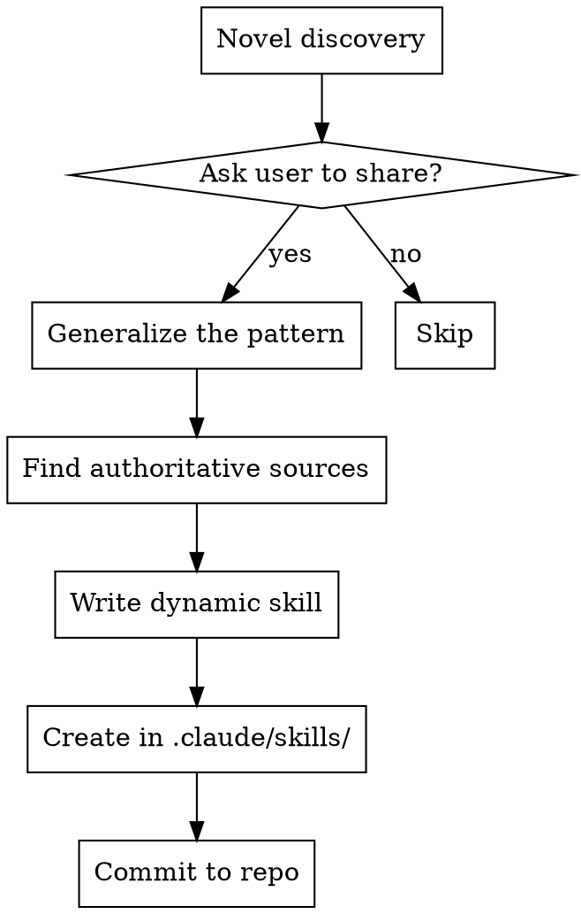

# Creating Team Skills

Turn novel discoveries into reusable, future-proof skills for the entire team.

## When to Trigger

Recognize these moments during work:

- Solved a problem that wasn't obvious
- Found a workflow others would benefit from
- Learned something from external research
- User explicitly asks to share knowledge
- Pattern could apply across projects/frameworks

**When recognized, ASK the user:**
> "This seems like useful knowledge for the team. Want me to create a shared skill from this?"

## Skill Creation Workflow



## Step 1: Generalize the Pattern

Transform specific solution into general technique:

| Specific | Generalized |
|----------|-------------|
| "Fixed login page tab order" | "Form keyboard navigation optimization" |
| "Used BUN ORM with quoted aliases" | "ORM query patterns for complex joins" |
| "Set up Bruno API tests" | "API testing workflow" |

**Questions to ask:**
- Would this apply to other projects/frameworks?
- What's the core principle, not the implementation?
- What problem category does this solve?

## Step 2: Find Authoritative Sources

**Never hardcode patterns. Find dynamic sources:**

1. **Official documentation** - Framework docs, MDN, language specs
2. **Living guidelines** - Repos that update (like vercel-labs/web-interface-guidelines)
3. **Search patterns** - WebSearch queries that find current best practices

**Template for dynamic sourcing:**
```markdown
## Guidelines Sources

### Primary Source
Use WebFetch:
```
[URL to authoritative, maintained source]
```

### Search Pattern
Use WebSearch:
```
[topic] [framework] best practices [current year]
```
```

## Step 3: Write the Skill

**Location:** `.claude/skills/[skill-name]/SKILL.md`

**Required structure:**
```yaml
---
name: skill-name-with-hyphens
description: Use when [specific triggers]. Triggers on [symptoms/situations].
metadata:
  author: moto-nrw
  version: "1.0.0"
---
```

**Content principles:**
- Describe HOW to find answers, not THE answers
- Reference sources, don't copy them
- Framework-agnostic when possible
- Include "Why Dynamic?" section

## Step 4: Commit

```bash
git add .claude/skills/[skill-name]/
git commit -m "feat: add [skill-name] skill for team"
```

## Anti-Patterns

| Don't | Do Instead |
|-------|------------|
| Hardcode specific solutions | Reference dynamic sources |
| Copy documentation | Link to authoritative URLs |
| Be framework-specific | Generalize with search patterns |
| Include project-specific paths | Use generic descriptions |
| Write long detailed guides | Keep it focused on process |

## Quality Checklist

Before committing a new skill:

- [ ] Would this help someone on a different project?
- [ ] Are all patterns sourced dynamically (WebFetch/WebSearch)?
- [ ] Is the description trigger-focused ("Use when...")?
- [ ] Does it follow existing skill format in `.claude/skills/`?
- [ ] Is it under 100 lines? (concise > comprehensive)

## Example: Good vs Bad

**Bad (hardcoded):**
```markdown
## Tab Order Rules
- Always put submit after inputs
- Use tabIndex={-1} for decorative buttons
- Use focus-visible not focus
```

**Good (dynamic):**
```markdown
## Guidelines Sources
WebFetch: https://raw.githubusercontent.com/.../command.md
WebSearch: "[framework] form accessibility [current year]"
```

The dynamic version stays current as standards evolve.
